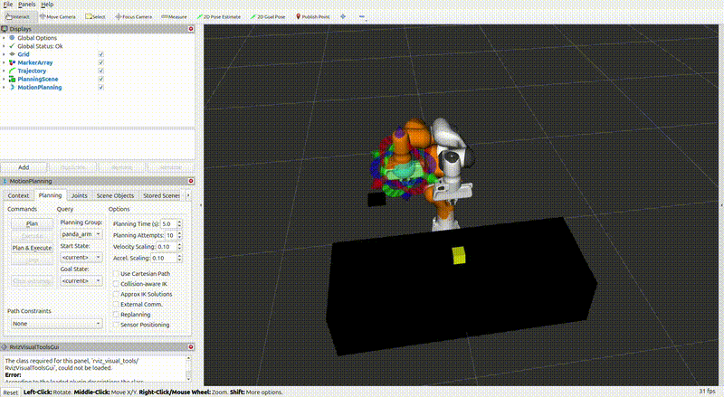
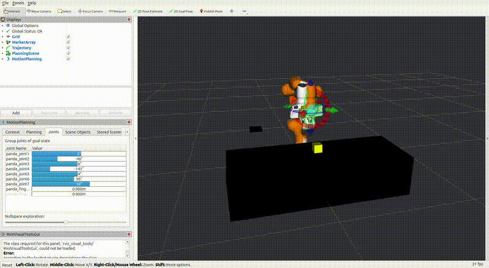
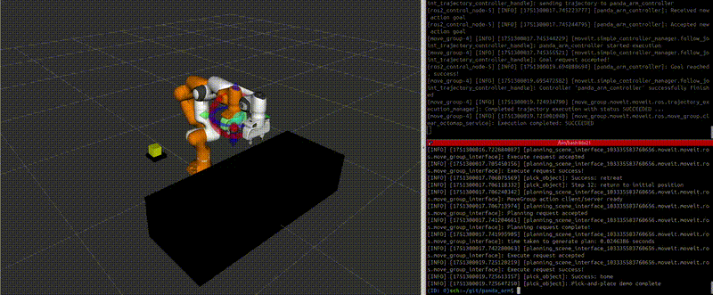

# Panda Pick-and-Place 시뮬레이션 (ROS 2 Jazzy)

이 프로젝트는 Franka Emika Panda 로봇팔을 사용하여 ROS 2 Jazzy 환경에서 Pick-and-Place 동작을 시뮬레이션하는 데모입니다.  
MoveIt 2 기반의 경로 계획과 RViz2 시각화, 그리퍼 제어, 오브젝트 생성이 포함되어 있으며, 전체 동작은 main 노드 하나로 실행됩니다.

---

## 데모

### 수동 조작 예시 (RViz 기반)

MoveIt2를 사용하면 슬라이더 또는 마우스를 통해 개별 관절이나 End Effector를 직접 조작할 수 있습니다.

#### 마우스 포인터로 관절 조작


#### 슬라이더 바로 관절 제어


---

### 자동 Pick-and-Place

이 프로젝트의 메인 기능은 박스를 집어 플랫폼 위에 정확하게 놓는 **자동화된 Pick-and-Place 동작**입니다.



---

## 프로젝트 구조

```
panda_pick_place_sim/
├── launch/                  # demo.launch.py 포함 (RViz + 컨트롤러 실행)
├── rviz/                    # moveit.rviz (시각화 레이아웃 설정)
├── src/
│   ├── main.cpp             # 전체 흐름 제어
│   ├── add_objects.cpp      # 테이블, 박스, 플랫폼 오브젝트 등록
│   ├── motion_planner.cpp   # 경로 계획 함수
│   ├── gripper_control.cpp  # 그리퍼 제어 함수
│   └── pose_utils.cpp       # Pose 유틸 함수
├── include/                 # 각 모듈용 헤더
├── setup_env.sh             # ROS 환경 및 워크스페이스 설정 스크립트
├── CMakeLists.txt
└── package.xml
```

---

## 실행 방법

### 1. 워크스페이스 생성 및 클론

```bash
mkdir -p ~/ros2_ws/src
cd ~/ros2_ws/src
git clone https://github.com/YOUR_USERNAME/panda_pick_place_sim.git
cd ..
```

### 2. 환경 설정 스크립트 실행

```bash
source src/panda_pick_place_sim/setup_env.sh
```

- ROS 2 Jazzy 설치 확인 및 설정
- colcon, rosdep, RViz 설치 여부 확인
- 빌드 여부 및 워크스페이스 자동 소싱

---

### 3. 시뮬레이션 실행

**터미널 1 – RViz 및 컨트롤러 실행**

```bash
ros2 launch panda_pick_place_sim demo.launch.py
```

**터미널 2 – Pick-and-Place 시나리오 실행**

```bash
ros2 run panda_pick_place_sim main
```

---

## 의존성 설치

ROS 2 및 ROS 패키지 의존성은 다음과 같이 설치할 수 있습니다.

### 필수 패키지 설치 (최초 1회)

```bash
sudo apt update
sudo apt install \
  ros-jazzy-desktop \
  python3-colcon-common-extensions \
  python3-rosdep \
  build-essential
```

### rosdep 초기화 및 의존성 설치

```bash
sudo rosdep init
rosdep update
rosdep install --from-paths src --ignore-src -r -y
```

---

## 주요 기능

- Panda 로봇팔의 Pick → Lift → Place → Return 전체 동작 자동화
- RViz2를 통한 직관적인 시각화
- MoveIt2 기반 경로 계획 (공간 및 카르테시안 경로 포함)
- 오브젝트의 동적 재등록 (`box`, `platform`, `table`)
- 초기화 → 동작 → 복귀까지 완전 자동 흐름 구성
- 코드를 유닛별로 분리하여 유지보수 용이

---

## 테스트 환경

- Ubuntu 24.04 LTS
- ROS 2 Jazzy
- MoveIt 2
- colcon
- RViz2

---
